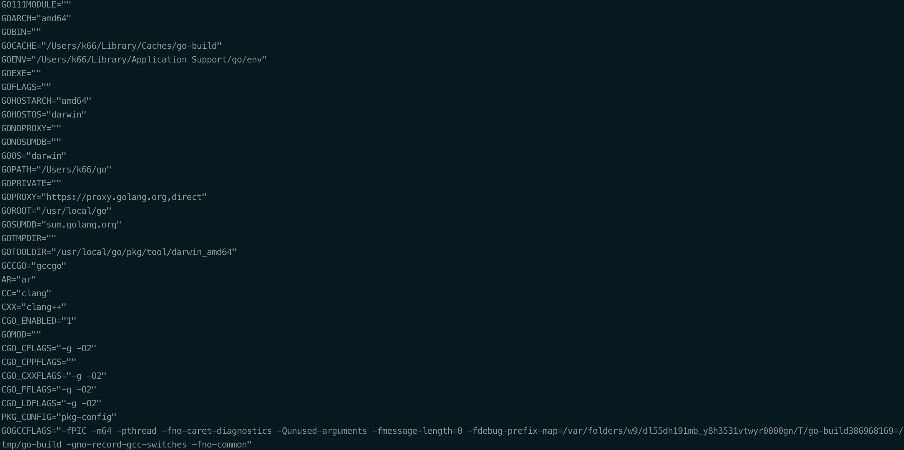

# study_go

# 开始

## Go安装


下载 ：从 [Go 官网](https://golang.google.cn/)下载对应系统的Go

安装,选择不太复杂的路劲保存Go

安装完成后通过命令行执行

```shell
go version
```

验证查看Go版本信息

配置GOPATH环境变量:

*GOPATH* 是一个环境变量，指向本机存放Go项目的目录（工作目录）

*GOPATH* 路劲最好只设置一个，所有的项目代码都放到*GOPATH*的src目录下

Linux环境编辑

```shell
sudo vi ~./bash_profile

export GOROOT='your go home'

export GOPATH='your dir'

export PATH=$PATH$:$GOROOT$/bin
```

保存后source ~./bash_profile使其生效

在GOPATH目录新建*src , pkg , bin*目录分别用来存放*源代码，包，执行文件*

执行

```shell
go env
```

将会看到如下系统环境信息




## go install 交叉编译

windows => linux

```shell
SET CGO_ENABLE=0  //禁用CGO

SET GOOS=linux  //目标平台linux

SET GOARCH=amd64 //目标处理器架构为amd64
```


mac => linux or windows

```shell
CGO_ENABLE=0 GOOS=linux GOARCH=amd64 go build

CGO_ENABLE=0 GOOS=windows GOARCH=amd64 go build
```


linux => mac or windows

```shell
CGO_ENABLE=0 GOOS=darwin GOARCH=amd64 go build

CGO_ENABLE=0 GOOS=windows GOARCH=amd64 go build
```


# Go语言文件的基本结构

```go
package main //包声明，如果为main，则生成可执行文件

//导入的包
import "fmt"

//main 函数，程序入口，如同c main函数或者java main
func main(){
   fmt.Println("Hello Go!")
}
```


## 变量和常量

### 标识符和关键字


#### 标识符

字母，数字和下划线"_"


#### 25个关键字


#### 37个保留字


### 变量

Go语言中必须先声明再使用变量

局部变量声明必须使用


```go
package main

import "fmt"

//普通声明
//var name string
//var age int
//var isMan bool

//批量声明
var(
   name string // ""
   age int // 0
   isMan bool //false
)
//全局变量必须以关键字开头如var ，const ， type等

func main(){
   name = "Jim"
   age = 18
   isMan = true
   //Go语言中变量必须使用
   fmt.Println(name , age , isMan)

   //局部变量声明必须使用否则编译不通过
   //var tmp string

   //声明并赋值
   var tmp string = "tmp"
   fmt.Printf(tmp)

   //类型推导声明
   var str = "str"
   fmt.Println(str)

   //简短变量声明,只能在函数里面使用
   num := 5
   fmt.Println(num)

   //匿名变量，比如某些函数返回多个返回值，而只需要使用一个，则其他的可用匿名变量接收
   //匿名变量不占用命名空间，不会分配内存，也不存在重复声明
   var fooValue , _ = foo()
   fmt.Println(fooValue)
}

func foo() (int , string){
   return 5 , "Ha"
}
```


### 常量


```go
const Pi = 3.14
const Pi2 = 2 * Pi
```


```go
const(
    Pi = 3.14
    Pi2 = 2 * Pi
)
```


```go
const( //n1,n2,n3的值均为100
    n1 = 100
    n2
    n3
)
```


#### iota

iota是Go语言里的常量计数器，只能在常量中使用。iota在const关键字出现的时候将被重置为0，const中每新增一行常量声明将使iota计数一次（iota可理解为const中的索引。使用iota能简化定义，在定义枚举时很有用。


```go
package main

import "fmt"

const pi = 3.1415926

const(
   ok = 200
   notFound = 404
   serverError = 500
)

const(
   n1 = 100
   n2
   n3
)

const(
   a1 = iota * 10 // 0 * 10
   a2             // 1 * 10
   a3             // 2 * 10
   a4             // 3 * 10
)

//常见的iota运用
//_使用
const(
   b1 = iota // 0 当const出现时重置
   b2        // 1
   _         // 2 _匿名变量，被丢弃
   b3        // 3
)

//插队情况
const(
   c1 = iota // 0
   c2 = 100  // 100
   c3        // 100
   c4        // 100
   c5 = iota // 4 , 常量没增加一个声明，iota计数+1
)

//多个常量声明在一行
const(
   d1 , d2 = iota + 1 , iota + 2  // 1 , 2
   d3 , d4 = iota + 1 , iota + 2  // 2 , 3  每新增一行常量声明iota计数才+1
)

//定义数量级
const(
   _ = iota
   kb = 1 << (10 * iota)
   mb = 1 << (10 * iota)
   gb = 1 << (10 * iota)
   tb = 1 << (10 * iota)
   pb = 1 << (10 * iota)
)

func main(){
   fmt.Println(n1 , n2 , n3)

   fmt.Println(a1 , a2 , a3 , a4)

   fmt.Println(b1, b2 ,b3)

   fmt.Println(c1, c3 ,c4 , c5)

   fmt.Println(d1 , d2 , d3 , d4)

   fmt.Println(kb , mb , gb , tb , pb)
}
```


### 基本数据类型

#### 整型

整型分为两大类：

- ​	按长度分为：*int8 , int16 , int 32 , int64*
- ​    对应的无符号为：*uint8 , uint16 , uint32 , uint64*

其中，*uint8*就是我们熟知的*byte* ， *int16*对应*short*类型，*int64*对应*long*类型

| 类型     | 描述                                                      |
| -------- | --------------------------------------------------------- |
| *uint8*  | 无符号8位整型 0 ~ 255                                     |
| *uint16* | 无符号16位整型 0 ~ 65535                                  |
| *uint32* | 无符号32位整型 0 ~ 4294967295                             |
| *uint64* | 无符号64位整型 0 ~ 18446744073709551615                   |
| *int8*   | 有符号8位整型 -128 ~ 127                                  |
| *int16*  | 有符号16位整型 -32768 ~ 32767                             |
| *int32*  | 有符号32位整型 -2147483648 ~ 2147483647                   |
| *int64*  | 有符号64位整型 -9223372036854775808 ~ 9223372036854775807 |

 ##### 特殊整型

| 类型    | 描述                                             |
| ------- | ------------------------------------------------ |
| uint    | 32位操作系统上就是uint32，64位操作系统就是uint64 |
| int     | 32位操作系统上就是int32，64位操作系统就是int64   |
| uintptr | 无符号整型，用于存放一个指针                     |

**注意**：在使用*int*和*uint*类型时，不能假定它是32位或64位的整型，而是考虑*int*和*uint*可能在不同平台上的差异

**注意事项**：获取对象的长度的内建*len()*函数返回的长度可以根据不同平台的字节长度进行变化。实际使用中，切片或map的元素数量等都可以用*int*来表示。在涉及到二进制传输、读写文件的结构描述时，为了保持文件的结构不会受到不同编译目标平台字节长度的影响，不要使用*int*和*uint*


#### 八进制&十六进制

```go
package main

import "fmt"

func main(){
   //十进制
   var a1 = 101
   fmt.Printf("%d \n" , a1)

   //十进制 -> 八进制
   fmt.Printf("%o \n" , a1)

   //十进制 -> 十六进制
   fmt.Printf("%x \n" , a1)

   //十进制 -> 二进制
   fmt.Printf("%b \n" , a1)

   //八进制
   a2 := 077
   fmt.Printf("%d \n" , a2)

   //十六进制
   a3 := 0x1234567
   fmt.Printf("%d \n" , a3)

   //查看变量类型
   fmt.Printf("%T \n" , a3)

   a4 := int8(9) //明确指定类型，否则为int类型
   fmt.Printf("%T \n" , a4)
}
```


#### 浮点型

| 类型    | 描述                  |
| ------- | --------------------- |
| float32 | 最大值math.MaxFloat32 |
| float64 | 最大值math.MaxFloat64 |

```go
package main

import (
   "fmt"
)

func main(){
   f1 := 1.23456 //float64 , Go中默认都为float64
   fmt.Printf("%T \n" , f1)

   f2 := float32(1.23456)
   fmt.Printf("%T \n" , f2)

   //f1 = f2  //float32类型的值不能直接赋值给float64类型
}
```


#### 布尔型

**注意**：Go中不允许将整型强制转换为布尔型


#### 字符串

Go语言中字符串以原生数据类型出现，使用字符串与其他原生类型（int，bool，float等）一样。

字符串内部实现使用*utf-8*编码。


```go
package main

import (
	"fmt"
	"math"
	"strings"
	"unicode/utf8"
)

func main(){
  
  //占位符,更多查看fmt包下doc.go
  n := 100
  fmt.Printf("%T \n" , n) //类型
  fmt.Printf("%v \n" , n) //值
  fmt.Printf("%b \n" , n) //二进制
  fmt.Printf("%d \n" , n) //十进制
  fmt.Printf("%o \n" , n) //八进制
  fmt.Printf("%x \n" , n) //十六进制

  s := "abc"
  fmt.Printf("%s \n" ,s) //字符
  fmt.Printf("%#v \n" ,s) //加#添加描述符比如字符串+""
  fmt.Printf("%T \n" , '沙')// 字符类型为int32
  
  //字节：1字节=8bit（8个二进制位）
  //1个字符'a'=1个字节
  //1个utf-8编码的汉字"沙"=一般占3个字节

	s1 := "adadad\rasdada"
	fmt.Println(s1)
	fmt.Println(len(s1))

	//多行字符串 ,``原样输出
	s2 := `
		第一行
		第二行
		第三行
          `
	fmt.Println(s2)

	s3 := `d:\file`
	fmt.Println(s3)

	//字符串相关操作
	//length
	fmt.Println(len(s3))

	//拼接
	name := "深田"
	word := "永美"
	fmt.Println(name + word)
	fmt.Printf("%s%s\n" , name , word)
	s4 := fmt.Sprintf("%s%s" , name , word)
	fmt.Println(s4)

	//分隔
	s5 := strings.Split(s3 , "\\")
	fmt.Println(s5)

	//包含
	fmt.Println(strings.Contains(s4 , "深田"))

	//前后缀判断
	fmt.Println(strings.HasPrefix(s4 , "永美"))
	fmt.Println(strings.HasSuffix(s4 , "永美"))

	//index
	fmt.Println(strings.Index(s4 , "田"))

	//join
	fmt.Println(strings.Join(s5 , "\\"))

	//非ASCII类型为rune类型
	str := "hello成都"
	//len()求的是byte字节数量
	n := len(str)
	fmt.Println(n)
	fmt.Println(utf8.RuneCountInString(str))

	//字符int值
	for i := 0 ; i < len(str) ; i++ {//byte
		fmt.Printf("%v(%c) \n" , str[i] , str[i])
	}

	//从字符传中拿出具体的字符
	for _, c := range str{//rune
		fmt.Printf("%c \n" , c)
	}

	//字符串修改，字符串是不能被修改的，只能重造
	changeString()

	//类型转换
	num := 20
	var f float64
	f = float64(num)
	fmt.Printf("%T %v \n" , f , f)
	sqrtDemo()
}

func changeString(){
	s1 := "big"
	byteS1 := []byte(s1)//强制转换为byte切片
	byteS1[0] = 'p'//设置第一个元素为新字符
	fmt.Println(string(byteS1))//将byte切片强制转换为字符串，new string

	s2 := "白萝卜"
	runeS2 := []rune(s2)//强制转换为rune切片
	runeS2[0] = '胡'//设置第一个元素为新字符
	fmt.Println(string(runeS2))//将rune切片强制转换为字符串，new string

}

func sqrtDemo(){
	var a, b = 3 , 4
	var c int
	c = int(math.Sqrt(float64(a*a + b*b)))
	fmt.Println(c)
}

```


##### 转义符

| 转义符 | 含义   |
| ------ | ------ |
| \r     | 回车符 |
| \n     | 换行符 |
| \t     | 制表符 |
| \‘     | 单引号 |
| \“     | 双引号 |
| \\\    | 反斜杠 |


##### byte和rune类型

Go中字符有以下两种：

1. uint8类型，或者叫byte类型，表示ASCII类型的一个字符
2. rune类型，表示一个utf-8字符

中文，日文，韩文等属于rune类型，rune类型实际是一个*int32*

Go使用了特殊的rune类型来处理Unicode，使基于Unicode的文本处理更为方便，也可以使用byte型进行默认字符串处理，性能和扩展性都有照顾。

```go
  str := "你好成都"

  //字符int值
	for i := 0 ; i < len(str) ; i++ {//byte
		fmt.Printf("%c \n" , str[i])
	}

	//从字符传中拿出具体的字符
	for _, c := range str{//rune
		fmt.Printf("%c \n" , c)
	}
```


##### 修改字符串

要修改字符串，需要先将其转换成***[]rune***或***[]byte***，都会重新分配内存，并复制字节数组

```go
func changeString(){
  s1 := "big"
  byteS1 := []byte(s1)
  byteS1[0] = 'p'
  fmt.Println(string(byteS1))
  
  s2 := "白萝卜"
  runeS2 := []rune(s2)
  runeS2[0] = '胡'
  fmt.Println(string(runeS2))
}
```

