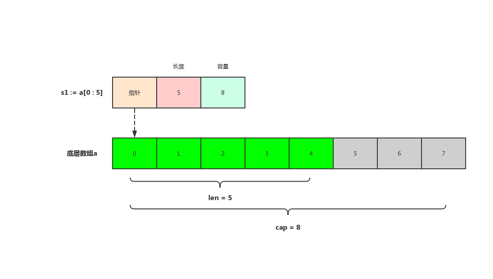
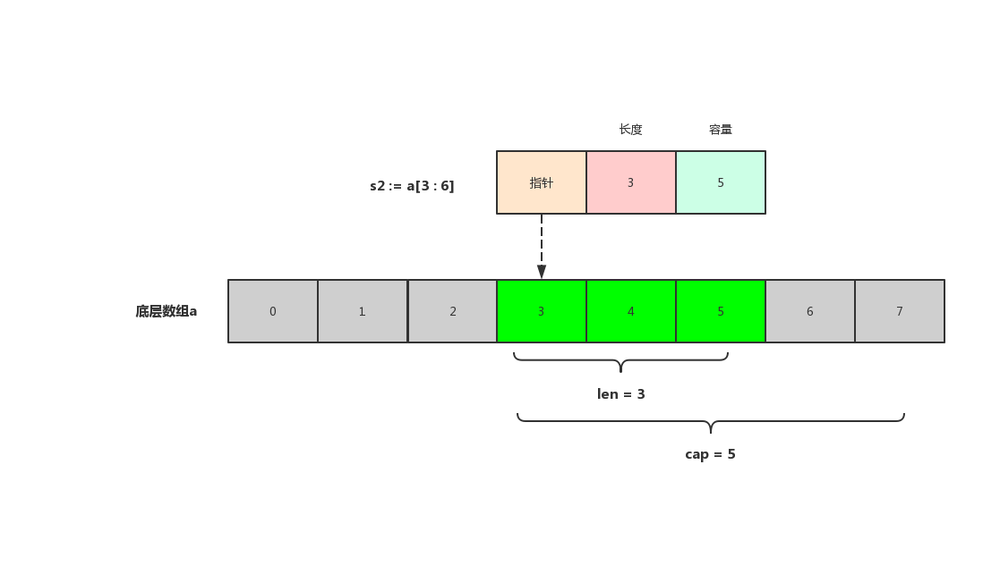
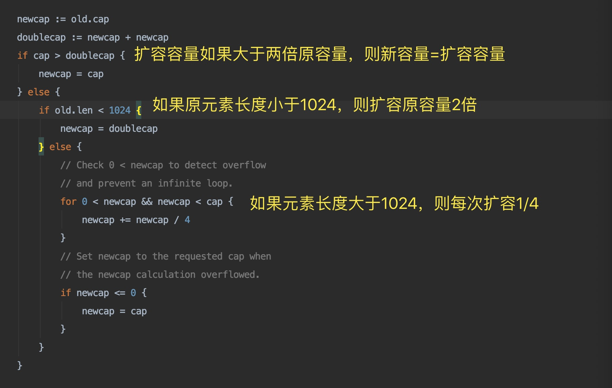
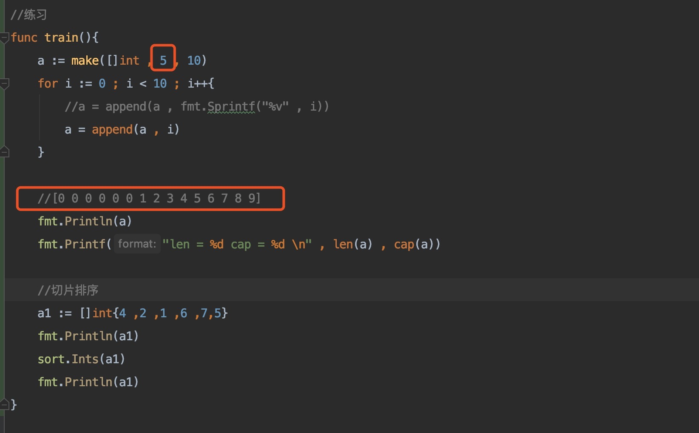
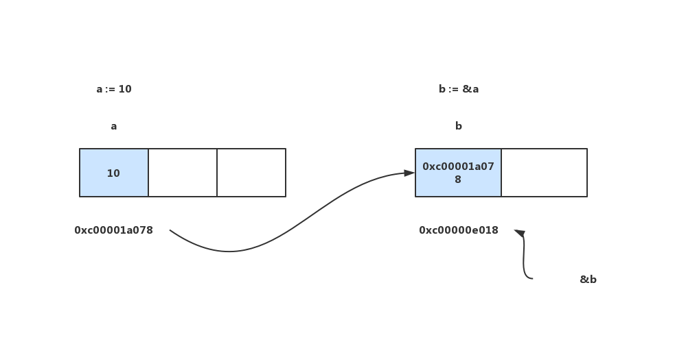

# study_go

# 开始

## Go安装


下载 ：从 [Go 官网](https://golang.google.cn/)下载对应系统的Go

安装,选择不太复杂的路劲保存Go

安装完成后通过命令行执行

```shell
go version
```

验证查看Go版本信息

配置GOPATH环境变量:

`GOPATH` 是一个环境变量，指向本机存放Go项目的目录（工作目录）

`GOPATH` 路劲最好只设置一个，所有的项目代码都放到`GOPATH`的src目录下

Linux环境编辑

```shell
sudo vi ~./bash_profile

export GOROOT='your go home'

export GOPATH='your dir'

export PATH=$PATH$:$GOROOT$/bin
```

保存后source ~./bash_profile使其生效

在GOPATH目录新建`src` , `pkg` , `bin`目录分别用来存放`源代码`，`包`，`执行文件`

执行

```shell
go env
```

将会看到如下系统环境信息


## go install 交叉编译

windows => linux

```shell
SET CGO_ENABLE=0  //禁用CGO

SET GOOS=linux  //目标平台linux

SET GOARCH=amd64 //目标处理器架构为amd64
```


mac => linux or windows

```shell
CGO_ENABLE=0 GOOS=linux GOARCH=amd64 go build

CGO_ENABLE=0 GOOS=windows GOARCH=amd64 go build
```


linux => mac or windows

```shell
CGO_ENABLE=0 GOOS=darwin GOARCH=amd64 go build

CGO_ENABLE=0 GOOS=windows GOARCH=amd64 go build
```


# Go语言文件的基本结构

```go
package main //包声明，如果为main，则生成可执行文件

//导入的包
import "fmt"

//main 函数，程序入口，如同c main函数或者java main
func main(){
   fmt.Println("Hello Go!")
}
```


## 变量和常量

### 标识符和关键字


#### 标识符

字母，数字和下划线"_"


#### 25个关键字


#### 37个保留字


### 变量

Go语言中必须先声明再使用变量

局部变量声明必须使用


```go
package main

import "fmt"

//普通声明
//var name string
//var age int
//var isMan bool

//批量声明
var(
   name string // ""
   age int // 0
   isMan bool //false
)
//全局变量必须以关键字开头如var ，const ， type等

func main(){
   name = "Jim"
   age = 18
   isMan = true
   //Go语言中变量必须使用
   fmt.Println(name , age , isMan)

   //局部变量声明必须使用否则编译不通过
   //var tmp string

   //声明并赋值
   var tmp string = "tmp"
   fmt.Printf(tmp)

   //类型推导声明
   var str = "str"
   fmt.Println(str)

   //简短变量声明,只能在函数里面使用
   num := 5
   fmt.Println(num)

   //匿名变量，比如某些函数返回多个返回值，而只需要使用一个，则其他的可用匿名变量接收
   //匿名变量不占用命名空间，不会分配内存，也不存在重复声明
   var fooValue , _ = foo()
   fmt.Println(fooValue)
}

func foo() (int , string){
   return 5 , "Ha"
}
```


### 常量


```go
const Pi = 3.14
const Pi2 = 2 * Pi
```


```go
const(
    Pi = 3.14
    Pi2 = 2 * Pi
)
```


```go
const( //n1,n2,n3的值均为100
    n1 = 100
    n2
    n3
)
```


#### iota

iota是Go语言里的常量计数器，只能在常量中使用。`iota`在`const`关键字出现的时候将被重置为0，`const`中每新增一行常量声明将使`iota`计数一次（`iota`可理解为`const`中的索引。使用`iota`能简化定义，在定义枚举时很有用。


```go
package main

import "fmt"

const pi = 3.1415926

const(
   ok = 200
   notFound = 404
   serverError = 500
)

const(
   n1 = 100
   n2
   n3
)

const(
   a1 = iota * 10 // 0 * 10
   a2             // 1 * 10
   a3             // 2 * 10
   a4             // 3 * 10
)

//常见的iota运用
//_使用
const(
   b1 = iota // 0 当const出现时重置
   b2        // 1
   _         // 2 _匿名变量，被丢弃
   b3        // 3
)

//插队情况
const(
   c1 = iota // 0
   c2 = 100  // 100
   c3        // 100
   c4        // 100
   c5 = iota // 4 , 常量没增加一个声明，iota计数+1
)

//多个常量声明在一行
const(
   d1 , d2 = iota + 1 , iota + 2  // 1 , 2
   d3 , d4 = iota + 1 , iota + 2  // 2 , 3  每新增一行常量声明iota计数才+1
)

//定义数量级
const(
   _ = iota
   kb = 1 << (10 * iota)
   mb = 1 << (10 * iota)
   gb = 1 << (10 * iota)
   tb = 1 << (10 * iota)
   pb = 1 << (10 * iota)
)

func main(){
   fmt.Println(n1 , n2 , n3)

   fmt.Println(a1 , a2 , a3 , a4)

   fmt.Println(b1, b2 ,b3)

   fmt.Println(c1, c3 ,c4 , c5)

   fmt.Println(d1 , d2 , d3 , d4)

   fmt.Println(kb , mb , gb , tb , pb)
}
```


### 基本数据类型

#### 整型

整型分为两大类：

- ​	按长度分为：`int8` , `int16` , `int` 32 , `int64`
- ​    对应的无符号为：`uint8` , `uint16` , `uint32` , `uint64`

其中，`uint8`就是我们熟知的`byte` ， `int16`对应`short`类型，`int64`对应`long`类型

| 类型   | 描述                                                      |
| ------ | --------------------------------------------------------- |
| uint8  | 无符号8位整型 0 ~ 255                                     |
| uint16 | 无符号16位整型 0 ~ 65535                                  |
| uint32 | 无符号32位整型 0 ~ 4294967295                             |
| uint64 | 无符号64位整型 0 ~ 18446744073709551615                   |
| int8   | 有符号8位整型 -128 ~ 127                                  |
| int16  | 有符号16位整型 -32768 ~ 32767                             |
| int32  | 有符号32位整型 -2147483648 ~ 2147483647                   |
| int64  | 有符号64位整型 -9223372036854775808 ~ 9223372036854775807 |

 ##### 特殊整型

| 类型    | 描述                                             |
| ------- | ------------------------------------------------ |
| uint    | 32位操作系统上就是uint32，64位操作系统就是uint64 |
| int     | 32位操作系统上就是int32，64位操作系统就是int64   |
| uintptr | 无符号整型，用于存放一个指针                     |

**注意**：在使用`int`和`uint`类型时，不能假定它是32位或64位的整型，而是考虑`int`*和*`uint`可能在不同平台上的差异

**注意事项**：获取对象的长度的内建`len()`函数返回的长度可以根据不同平台的字节长度进行变化。实际使用中，切片或`map`的元素数量等都可以用`int`来表示。在涉及到二进制传输、读写文件的结构描述时，为了保持文件的结构不会受到不同编译目标平台字节长度的影响，不要使用`int`和`uint`


#### 八进制&十六进制

```go
package main

import "fmt"

func main(){
   //十进制
   var a1 = 101
   fmt.Printf("%d \n" , a1)

   //十进制 -> 八进制
   fmt.Printf("%o \n" , a1)

   //十进制 -> 十六进制
   fmt.Printf("%x \n" , a1)

   //十进制 -> 二进制
   fmt.Printf("%b \n" , a1)

   //八进制
   a2 := 077
   fmt.Printf("%d \n" , a2)

   //十六进制
   a3 := 0x1234567
   fmt.Printf("%d \n" , a3)

   //查看变量类型
   fmt.Printf("%T \n" , a3)

   a4 := int8(9) //明确指定类型，否则为int类型
   fmt.Printf("%T \n" , a4)
}
```


#### 浮点型

| 类型    | 描述                  |
| ------- | --------------------- |
| float32 | 最大值math.MaxFloat32 |
| float64 | 最大值math.MaxFloat64 |

```go
package main

import (
   "fmt"
)

func main(){
   f1 := 1.23456 //float64 , Go中默认都为float64
   fmt.Printf("%T \n" , f1)

   f2 := float32(1.23456)
   fmt.Printf("%T \n" , f2)

   //f1 = f2  //float32类型的值不能直接赋值给float64类型
}
```


#### 布尔型

**注意**：Go中不允许将整型强制转换为布尔型


#### 字符串

Go语言中字符串以原生数据类型出现，使用字符串与其他原生类型（`int`，`bool`，`float`等）一样。

字符串内部实现使用*utf-8*编码。


```go
package main

import (
    "fmt"
    "math"
    "strings"
    "unicode/utf8"
)

func main(){
  
    //占位符,更多查看fmt包下doc.go
    n := 100
    fmt.Printf("%T \n" , n) //类型
    fmt.Printf("%v \n" , n) //值
    fmt.Printf("%b \n" , n) //二进制
    fmt.Printf("%d \n" , n) //十进制
    fmt.Printf("%o \n" , n) //八进制
    fmt.Printf("%x \n" , n) //十六进制

    s := "abc"
    fmt.Printf("%s \n" ,s) //字符
    fmt.Printf("%#v \n" ,s) //加#添加描述符比如字符串+""
    fmt.Printf("%T \n" , '沙')// 字符类型为int32
  
    //字节：1字节=8bit（8个二进制位）
    //1个字符'a'=1个字节
    //1个utf-8编码的汉字"沙"=一般占3个字节

    s1 := "adadad\rasdada"
    fmt.Println(s1)
    fmt.Println(len(s1))

    //多行字符串 ,``原样输出
    s2 := `
	  第一行
  	  第二行
	  第三行
          `
    fmt.Println(s2)

    s3 := `d:\file`
    fmt.Println(s3)

    //字符串相关操作
    //length
    fmt.Println(len(s3))

    //拼接
    name := "深田"
    word := "永美"
    fmt.Println(name + word)
    fmt.Printf("%s%s\n" , name , word)
    s4 := fmt.Sprintf("%s%s" , name , word)
    fmt.Println(s4)

    //分隔
    s5 := strings.Split(s3 , "\\")
    fmt.Println(s5)

    //包含
    fmt.Println(strings.Contains(s4 , "深田"))

    //前后缀判断
    fmt.Println(strings.HasPrefix(s4 , "永美"))
    fmt.Println(strings.HasSuffix(s4 , "永美"))

    //index
    fmt.Println(strings.Index(s4 , "田"))

    //join
    fmt.Println(strings.Join(s5 , "\\"))

    //非ASCII类型为rune类型
    str := "hello成都"
    //len()求的是byte字节数量
    n := len(str)
    fmt.Println(n)
    fmt.Println(utf8.RuneCountInString(str))

    //字符int值
    for i := 0 ; i < len(str) ; i++ {//byte
        fmt.Printf("%v(%c) \n" , str[i] , str[i])
    }

    //从字符传中拿出具体的字符
    for _, c := range str{//rune
        fmt.Printf("%c \n" , c)
    }

    //字符串修改，字符串是不能被修改的，只能重造
    changeString()

    //类型转换
    num := 20
    var f float64
    f = float64(num)
    fmt.Printf("%T %v \n" , f , f)
    sqrtDemo()
}

func changeString(){
    s1 := "big"
    byteS1 := []byte(s1)//强制转换为byte切片
    byteS1[0] = 'p'//设置第一个元素为新字符
    fmt.Println(string(byteS1))//将byte切片强制转换为字符串，new string

    s2 := "白萝卜"
    runeS2 := []rune(s2)//强制转换为rune切片
    runeS2[0] = '胡'//设置第一个元素为新字符
    fmt.Println(string(runeS2))//将rune切片强制转换为字符串，new string

}

func sqrtDemo(){
    var a, b = 3 , 4
    var c int
    c = int(math.Sqrt(float64(a*a + b*b)))
    fmt.Println(c)
}

```


##### 转义符

| 转义符 | 含义   |
| ------ | ------ |
| \r     | 回车符 |
| \n     | 换行符 |
| \t     | 制表符 |
| \‘     | 单引号 |
| \“     | 双引号 |
| \\\    | 反斜杠 |


##### byte和rune类型

Go中字符有以下两种：

1. `uint8`类型，或者叫`byte`类型，表示ASCII类型的一个字符
2. `rune`类型，表示一个utf-8字符

中文，日文，韩文等属于`rune`类型，`rune`类型实际是一个`int32`

Go使用了特殊的`rune`类型来处理Unicode，使基于Unicode的文本处理更为方便，也可以使用`byte`型进行默认字符串处理，性能和扩展性都有照顾。

```go
str := "你好成都"

//字符int值
for i := 0 ; i < len(str) ; i++ {//byte
    fmt.Printf("%c \n" , str[i])
}

//从字符传中拿出具体的字符
for _, c := range str{//rune
    fmt.Printf("%c \n" , c)
}
```


##### 修改字符串

要修改字符串，需要先将其转换成`[]rune`或`[]byte`，都会重新分配内存，并复制字节数组

```go
func changeString(){
    s1 := "big"
    byteS1 := []byte(s1)
    byteS1[0] = 'p'
    fmt.Println(string(byteS1))
  
    s2 := "白萝卜"
    runeS2 := []rune(s2)
    runeS2[0] = '胡'
    fmt.Println(string(runeS2))
}
```


### if  for

```go
package main

import "fmt"

func main(){

   //if
   //基本
   age := 18
   if age > 18{
      fmt.Println("老男孩")
   }else if age == 18{
      fmt.Println("刚好成年")
   }else{
      fmt.Println("小屁孩")
   }

   //局部
   if age := 20 ; age < 35 && age > 18{
      fmt.Println("还年轻")
   }else if age < 18{
      fmt.Println("small boy")
   }

   //for
   //基本
   for i := 0 ; i < 10 ; i++{
      fmt.Println(i)
   }

   //省略变量
   i := 5
   for ; i < 10 ; i++{
      fmt.Println(i)
   }

   //省略结束
   for ; i < 10 ;{
      fmt.Println(i)
      i++
   }

   //无限循环
   //for {
   // fmt.Println(1)
   //}

   //for range
   s := "hello沙河"
   for i , v := range s{
      fmt.Printf("%d %c \n" , i , v)
   }
}
```


**注意** for range循环中输出格式为：

```shell
0 h 
1 e 
2 l 
3 l 
4 o 
5 沙 
8 河 
```

下标从5直接编程8的原因是一个unicode字符占3个字节！！！


### 复合数据类型

#### 数组

```go
//定义一个长度为5的int数组
var array [3]int
```

数组定义，数组长度不可变


```go
package main

import "fmt"

/*
数组
存放元素的容器
必须指定存放的元素类型和长度
*/
func main() {
   //数组定义
   var a1 [3]int
   var a2 [4]int
   fmt.Printf("%T %T \n", a1, a2)

   //数组初始化
   //如果不初始化，默认均为数据类型默认值
   fmt.Println(a1, a2)

   a1 = [3]int{1, 2, 3}
   fmt.Println(a1)

   //[...]根据初始值自动推断数组长度
   a10 := [...]int{1, 2, 3, 4, 5}
   fmt.Println(a10)
   fmt.Println(len(a10))

   a3 := [5]int{1, 2}
   fmt.Println(a3)

   //根据索引来初始化
   a4 := [5]int{0: 4, 4: 3}
   fmt.Println(a4)

   //数组遍历
   cities := [3]string{"北京", "成都", "广州"}
   //根据索引遍历
   for i := 0; i < len(cities); i++ {
      fmt.Println(cities[i])
   }

   //for range
   for i, v := range cities {
      fmt.Println(i, v)
   }

   //多维数组
   //[[1,2] , [3,4] , [5,6]]
   aa1 := [3][2]int{{1, 2}, {3, 4}, {5, 6}}
   fmt.Println(aa1)

   //多维数组遍历
   for _, v := range aa1 {
      fmt.Println(v)
      for _, v2 := range v {
         fmt.Println(v2)
      }
   }

   //数组是值类型
   b1 := [3]int{1, 2, 3} //[1 2 3]
   b2 := b1              //[1 2 3] ctrl+c => ctrl+v
   b2[0] = 100           //b2:[100 2 3]
   fmt.Println(b1, b2)   //b1:?

   //数组值类型比较
   c1 := [3]int{1 ,2 ,3}
   c2 := [3]int{1 ,2 ,3}
   fmt.Println(c1 == c2)
}
```


数组是值类型，赋值和传参会复制整个数组。因此改变副本的值，不会改变本身的值


#### 切片（slice）

切片是一个拥有相同类型元素的可变长度的序列。它是基于数组类型做的一层封装。类似于Java的ArrayList。

切片是一个引用类型，它的内部结构包含`地址`，`长度`，和`容量`。切片一般用于快速的操作一块数据集合。


```go
var name []T//切片定义
```


**切片cap与len的区别**

切片的长度就是它元素的个数

切片的容量是底层数组从切片第一个元素到最后一个元素的容量

```go
var a [8]int = [8]int{1 , 2 , 3 , 4 , 5 , 6 , 7 , 8}
s1 := a[0 : 5]
fmt.Println(len(s1) , cap(s1)) //len = 5 , cap = 8
```




```go
s2 := [3 : 6]
fmt.Println(len(s2) , cap(s2)) //len = 3  , cap = 5
```




容量是指底层数组的大小，长度指可以使用的大小

容量的用处在哪？在与当你用 `append`扩展长度时，如果新的长度小于容量，不会更换底层数组，否则，go 会新申请一个底层数组，拷贝这边的值过去，把原来的数组丢掉。也就是说，**容量的用途是：在数据拷贝和内存申请的消耗与内存占用之间提供一个权衡**。

而长度，则是为了帮助你限制切片可用成员的数量，提供边界查询的。所以用 make 申请好空间后，需要注意不要越界【越 len 】


```go
package main

import "fmt"

func main(){
   var s1 []int //定义一个存放int类型元素的切片
   var s2 []string //定义一个存放string类型元素的切片
   fmt.Println(s1 ,s2)
   fmt.Println(s1 == nil)
   fmt.Println(s2 == nil)

   s1 = []int{1 , 2 ,3}
   s2 = []string{"北京" , "成都" , "广州"}
   fmt.Println(s1 , s2)
   fmt.Println(len(s1) , len(s2))

   //长度和容量
   fmt.Printf("len(s1) : %d cap(s1) : %d \n" , len(s1) , cap(s1))
   fmt.Printf("len(s2) : %d cap(s2) : %d \n" , len(s2), cap(s2))

   //由数组得到切片
   a1 := [...]int{1 , 3 , 5 , 7 , 9 , 11 , 13}
   s3 := a1[0 : 4] //[1 3 5 7] 基于一个数组切割，左包含右不包含，左闭右开
   fmt.Println(s3)

   s4 := a1[ : 4] //=> [0 : 4] 从开始切割到指定位置
   fmt.Println(s4)

   s5 := a1[3 : ] //=> [3 : len(a1)] 从指定位置切割到最后
   fmt.Println(s5)

   s6 := a1[:]//=> [0 : len(a1)] 从开始切割到最后
   fmt.Println(s6)

   //切片再切片
   //首先看由数组切割而来的切片的长度与容量
   //长度为4 ， 容量为7
   fmt.Printf("len(s4) : %d cap(s4) : %d \n" , len(s4), cap(s4))

   //长度为4 ， 容量为4
   //底层数组从切片的第一个元素到最后的元素数量
   fmt.Printf("len(s5) : %d cap(s5) : %d \n" , len(s5), cap(s5))

   //再切割
   s7 := s5[3 : ] //[7 9 11 13]
   fmt.Printf("len(s7) : %d cap(s7) : %d \n" , len(s7), cap(s7))

   //引用体现，底层数组值改了，切片的值都会更改
   a1[6] = 1300
   fmt.Println(s5 , s6 ,s7)//[7 9 11 1300] [1 3 5 7 9 11 1300] [1300]
}
```


##### 使用make函数构造切片

```go
make([]T , len , cap)

make([]T , len) => make([]T , len , len)
```


```go
package main

import "fmt"

func main(){

   //s1 = [0 0 0 0 0] len(s1) = 5 cap(s1) = 10
   s1 := make([]int , 5 , 10)
   fmt.Printf("s1 = %v len(s1) = %d cap(s1) = %d\n" , s1 , len(s1) , cap(s1))

   //s0 = [0 0 0 0 0] len(s0) = 5 cap(s0) = 5
   s0 := make([]int , 5)
   fmt.Printf("s0 = %v len(s0) = %d cap(s0) = %d\n" , s0 , len(s0) , cap(s0))

   //s2 = [] len(s2) = 0 cap(s2) = 10
   s2 := make([]int , 0 , 10)
   fmt.Printf("s2 = %v len(s2) = %d cap(s2) = %d\n" , s2 , len(s2) , cap(s2))
}
```


##### 切片的本质

切片的本质是对底层数组的封装，它包含3个信息：`底层数组指针`，`切片的长度（len）`，`切片的容量（cap）`

切片就是一个框，框柱了一块连续的内存。是一个**引用类型**，真正的数据都是保存在底层数组里。


##### 切片不能直接比较

切片之间是不能比较的，我们不能使用==来判断两个切片是否含有全部相等的元素。切片唯一合法的比较操作是和`nil`比较。一个nil值得切片并没有底层数组，一个`nil`值的切片的长度和容量都是0.但是不能说一个长度和容量为0的切片一定是nil

```go
var s1 = []int //len(s1) = 0 , cap(s1) = 0 , s1 == nil //true
s2 := []int{} //len(s2) = 0 , cap(s2) = 0 , s2 != nil //true 
s3 := make([]int , 0) //len(s3) = 0 , cap(s3) = 0 , s3 != nil //true 
```

所以要判断一个切片是否是空的，要用len(s) == 0来判断，不应该使用 s == nil


##### append

```go
func sliceAppend(){
   s1 := []string{"北京" , "上海" , "深圳"}
   fmt.Printf("len(s1) = %d cap(s1) = %d %v\n" , len(s1) , cap(s1) , s1)

   //append追加元素，原来底层数组放不下的时候，go将创建一个新的数组来存放元素
   //所以s1这里接收的是一个新的数组
   s1 = append(s1, "成都")
   fmt.Printf("len(s1) = %d cap(s1) = %d %v\n" , len(s1) , cap(s1) , s1)

   s2 := []string{"广州" , "杭州"}
   s1 = append(s1 , s2...)//...表示拆开
   fmt.Printf("len(s1) = %d cap(s1) = %d %v\n" , len(s1) , cap(s1) , s1)

   //简原来的的容量小于1024时直接扩充至原来的2倍 ， 大于1024时每次扩充1/4
   s1 = append(s1, "重庆")
   fmt.Printf("len(s1) = %d cap(s1) = %d %v\n" , len(s1) , cap(s1) , s1)
}
```


##### append扩容策略

slice.go源码分析



- 首先判断，如果新申请容量（cap）大于2倍的旧容量（old.cap）,最终容量（newcap）就是新申请的容量
- 否则判断，如果旧切片的长度小于1024，则最终容量（newcap）就是旧容量（old.cap）的两倍，既（newcap = doublecap）
- 否则判断，如果旧切片长度大于等于1024，则最终容量（newcap）从旧容量（old.cap）开始循环增加原来的1/4，既（newcap=old.cap , for {newcap += newcap/4}）直到最终容量（newcap）大于等于新申请的容量（cap），既（newcap >= cap）
- 如果最终容量（cap）计算溢出，则最终容量（cap）就是新申请的容量（cap）


##### copy

```go
func sliceCopy() {
   a1 := []int{1 ,3 , 5}
   a2 := a1 //赋值 ， 指向同一个内存
   var a3 = make([]int , 3 , 3)
   copy(a3 , a2) //copy , 创建了一个新的数组 ， 新开辟了内存
   fmt.Println(a1 , a2 , a3)
   a1[0] = 100
   fmt.Println(a1 , a2 , a3)
}
```


##### 删除元素

go中切片没有删除元素，可使用切片本身特性来删除元素，底层数组在此操作的时候是将元素向左移动

```go
func sliceDel(){
   a := []int{1 , 2 , 3 , 4 , 5}

   //要删除索引为2的元素，a[:2]从0开始到2但不包含2[1 2] ， a[3:]...从3开始到最后[4 5]
   a = append(a[:2] , a[3:]...)
   fmt.Println(a)
   fmt.Printf("cap(a) = %d \n" , cap(a))

   a1 := [...]int{1 ,3 ,5} //数组
   s1 := a1[:] //切片
   fmt.Println(s1 , len(s1) , cap(s1))
   fmt.Printf("%p \n" , &a1)
   //1.切片不保存具体的值
   //2.切片对应一个底层的数组
   //3.底层数组占用一块联系的数组
   s1 = append(s1[:1] , s1[2:]...)
   fmt.Println(s1 , len(s1) , cap(s1))
   fmt.Println(a1)
   fmt.Printf("%p \n" , &a1)
}
```


##### 练习




#### 指针

go语言中不存在指针操作，只需要记住两个符号：

1. `&`：取地址
2. `*`：根据地址取值

取地址操作符`&`和取值操作符`*`是一对互补操作符

`b := &a`的图示



##### new和make

`new`和`make`都是用来分配内存的函数

##### new

`new`函数很少用，一般用来申请分配基本数据类型的内存地址，如`string`,`int`等，返回的是对应类型的**指针**

```go
	//nil pointer
	//var a *int
	//*a = 100

//new函数申请一个内存地址
var a = new(int)
fmt.Println(a , *a)
*a = 100
fmt.Println(*a)
```


##### make

`make`也是用于内存分配，区别于`new`，它只用于`slice`，`map`，`chan`的内存创建，而且**它返回的类型就是这三个类型本身**，而不是他们的指针类型。因为这三种类型就是引用类型，所以就没有必要返回他们的指针了。`make`函数的函数签名如下：

```go
func make(t Type , size ...IntegerType) Type
```

`make`函数是无可替代的，在使用`slice`，`map`，`channel`时，都需要使用make进行初始化后才可进行操作。